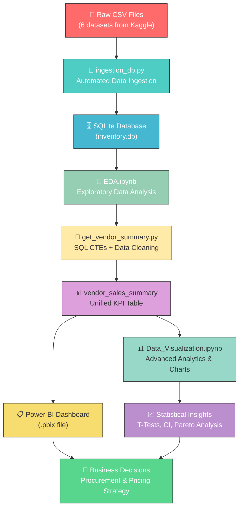

<p align="center">
  
  
  
  
  
  
</p>

<h1 align="center">📊 Vendor Performance Analysis</h1>

<p align="center">
  <b>End-to-end data analytics pipeline for evaluating vendor profitability, inventory efficiency, and procurement optimization in the retail beverage industry.</b>
</p>

<p align="center">
  <a href="#-problem-statement">Problem Statement</a> •
  <a href="#-key-insights">Key Insights</a> •
  <a href="#-features">Features</a> •
  <a href="#-tech-stack">Tech Stack</a> •
  <a href="#-project-structure">Project Structure</a> •
  <a href="#-getting-started">Getting Started</a>
</p>

---

## 🎯 Problem Statement

In the retail and wholesale beverage industry, businesses work with **hundreds of vendors** supplying **thousands of product brands**. Without a structured analytical framework, critical questions remain unanswered:

- **Which vendors are the most profitable?** — Not all high-volume vendors deliver high margins.
- **Where is capital being locked?** — Slow-moving inventory ties up working capital with zero returns.
- **Does bulk purchasing actually reduce costs?** — Procurement teams need data-backed evidence for negotiation.
- **Are there significant differences in profit margins between top and bottom performers?** — Statistical proof is needed, not assumptions.
- **How do freight costs impact vendor profitability?** — Hidden logistics costs can erode margins.

### ✅ What This Project Solves

This project builds a **complete data analytics pipeline** — from raw CSV ingestion into a SQLite database, through exploratory data analysis (EDA), to interactive visualizations and a Power BI dashboard — that answers all of the above questions with **data-driven insights and statistical validation**.

---

## 🔑 Key Insights

| Insight | Finding |
|---|---|
| 🏆 **Top Vendor by Sales** | DIAGEO NORTH AMERICA INC (~$68M total sales) |
| 🥃 **Top Brand by Sales** | Jack Daniels No 7 Black (~$8M) |
| 📊 **Top 10 Vendor Concentration** | Top 10 vendors contribute **66%** of total purchase volume (Pareto Principle) |
| 💰 **Bulk Purchasing Impact** | Large orders avg. **$10.78/unit** vs. Small orders avg. **$39.07/unit** — 72% cost reduction |
| 📈 **Purchase-Sales Correlation** | Near-perfect correlation (**0.999**) between purchase & sales quantities |
| 🔬 **Profit Margin Gap** | Top-performing vendors: **31.18% avg. margin** vs. Low-performing vendors: **41.57% avg. margin** |
| 📉 **Statistical Validation** | Two-Sample T-Test (P-Value: **0.0000**) confirms significant margin difference |
| 🔒 **Slow-Moving Inventory** | ~15% of brands show stock turnover ratio < 1, indicating locked capital |
| 🚚 **Freight Efficiency** | Large vendor freight costs: **0.5%–2%** of purchase value; small vendors often exceed 3% |

> **💡 Surprising Insight:** Low-volume vendors tend to have *higher* profit margins than high-volume vendors — suggesting an opportunity to negotiate better terms with top vendors or diversify procurement.

---

## ✨ Features

- 🗄️ **Automated Data Ingestion** — Bulk CSV-to-SQLite pipeline with logging and performance tracking
- 🔍 **Comprehensive EDA** — Statistical profiling of 6 data tables (purchases, sales, vendor invoices, purchase prices, begin/end inventory)
- 📊 **Advanced SQL Analytics** — Complex CTEs (Common Table Expressions) merging freight, purchase, and sales data into a unified vendor summary
- 📈 **Rich Visualizations** — Histograms, box plots, heatmaps, Pareto charts, donut charts, and comparative distribution plots
- 🧮 **Derived KPIs** — Gross Profit, Profit Margin (%), Stock Turnover Ratio, Sales-to-Purchase Ratio, Locked Capital
- 📐 **Statistical Testing** — Confidence Intervals (95%) and Two-Sample T-Tests for profit margin comparison
- 📋 **Power BI Dashboard** — Interactive `.pbix` dashboard for business stakeholders
- 📝 **Production Logging** — Structured logging for both ingestion and summary generation pipelines

---

## 🛠️ Tech Stack

| Category | Technologies |
|---|---|
| **Language** | Python 3.13 |
| **Data Processing** | Pandas, NumPy |
| **Database** | SQLite, SQLAlchemy |
| **Visualization** | Matplotlib, Seaborn, Plotly |
| **Statistical Analysis** | SciPy (scipy.stats) |
| **Dashboard** | Microsoft Power BI |
| **Notebooks** | Jupyter Notebook |
| **Logging** | Python `logging` module |

---

## 📂 Project Structure

```
vendor_performance_analysis/
│
├── 📓 EDA.ipynb                          # Exploratory Data Analysis notebook
│                                          #   → Data profiling, null checks, distributions
│                                          #   → 6 tables: purchases, sales, vendor_invoice,
│                                          #     purchase_prices, begin_inventory, end_inventory
│
├── 📊 Data_Visualization.ipynb           # Advanced visualization & statistical analysis
│                                          #   → Pareto charts, heatmaps, box plots
│                                          #   → T-Tests, confidence intervals
│                                          #   → Top vendor/brand analysis
│
├── 🐍 ingestion_db.py                    # CSV → SQLite automated ingestion pipeline
│                                          #   → Reads all CSVs from data/ directory
│                                          #   → Creates tables in inventory.db
│                                          #   → Logs ingestion time & status
│
├── 🐍 get_vendor_summary.py             # Vendor summary generation script
│                                          #   → Complex SQL CTEs merging 3 tables
│                                          #   → Data cleaning & derived KPI columns
│                                          #   → GrossProfit, ProfitMargin, StockTurnover
│
├── 📊 vendor_Performance_Dashboard.pbix  # Power BI interactive dashboard
│
├── 📓 Untitled.ipynb                     # Development scratch notebook
│
├── 📁 logs/                              # Pipeline execution logs
│   ├── ingestion_db.log                  #   → CSV ingestion logs with timestamps
│   └── get_vendor_summary.log            #   → Summary generation logs
│
└── 📄 README.md                          # Project documentation
```

---

## 🔄 Project Workflow



---

## 📦 Dataset

**Source:** Kaggle — Vendor Performance Analysis Datasets

🔗 **Dataset Link:** [https://www.kaggle.com/search?q=vendor+performance+analysis+in%3Adatasets](https://www.kaggle.com/search?q=vendor+performance+analysis+in%3Adatasets)

### Tables & Scale

| Table | Records | Columns | Description |
|---|---|---|---|
| `purchases` | ~2.37M | 14 | Purchase orders with vendor, brand, quantity, price |
| `sales` | ~12.8M | 8 | Sales transactions with quantity, dollars, excise tax |
| `vendor_invoice` | ~9,453 | 14 | Invoice details including freight costs |
| `purchase_prices` | ~11,272 | 6 | Reference pricing with volume information |
| `begin_inventory` | ~2,192 | 16 | Opening inventory snapshot |
| `end_inventory` | ~2,192 | 16 | Closing inventory snapshot |
| `vendor_sales_summary` | ~10,692 | 18 | **Derived** — Unified vendor performance KPIs |

> ⚠️ Download the raw CSV files from Kaggle and place them in a `data/` directory at the project root before running the ingestion script.

---

## 🚀 Getting Started

### Prerequisites

- **Python 3.10+** installed
- **Jupyter Notebook** or **JupyterLab**
- **Microsoft Power BI Desktop** (optional, for the `.pbix` dashboard)

### Installation

```bash
# 1. Clone the repository
git clone https://github.com/Tansukh18/vendor_performance_analysis.git
cd vendor_performance_analysis

# 2. Create a virtual environment (recommended)
python -m venv venv
source venv/bin/activate        # macOS/Linux
# venv\Scripts\activate         # Windows

# 3. Install dependencies
pip install pandas numpy matplotlib seaborn plotly scipy sqlalchemy jupyter

# 4. Download dataset from Kaggle and place CSVs in data/ folder
mkdir data
# Place: purchases.csv, sales.csv, vendor_invoice.csv,
#        purchase_prices.csv, begin_inventory.csv, end_inventory.csv

# 5. Run the data ingestion pipeline
python ingestion_db.py

# 6. Generate the vendor summary table
python get_vendor_summary.py

# 7. Launch Jupyter and explore the notebooks
jupyter notebook
```

### Execution Order

```
1️⃣  ingestion_db.py          → Ingest CSVs into SQLite
2️⃣  get_vendor_summary.py    → Create unified summary table
3️⃣  EDA.ipynb                → Explore & profile the data
4️⃣  Data_Visualization.ipynb → Generate insights & visualizations
5️⃣  vendor_Performance_Dashboard.pbix → Open in Power BI
```

---

## 🧰 Setup Tools

| Tool | Purpose | Install Command |
|---|---|---|
| Python 3.13 | Runtime | [python.org/downloads](https://www.python.org/downloads/) |
| Pandas | Data manipulation | `pip install pandas` |
| NumPy | Numerical computing | `pip install numpy` |
| Matplotlib | Static visualizations | `pip install matplotlib` |
| Seaborn | Statistical plots | `pip install seaborn` |
| Plotly | Interactive charts | `pip install plotly` |
| SciPy | Statistical tests | `pip install scipy` |
| SQLAlchemy | Database ORM | `pip install sqlalchemy` |
| Jupyter | Notebook environment | `pip install jupyter` |
| Power BI | Interactive dashboard | [Download](https://powerbi.microsoft.com/desktop/) |

---

## 📊 Analytical Methods Used

| Method | Purpose |
|---|---|
| **Pareto Analysis (80/20)** | Identify the vital few vendors driving majority of volume |
| **Correlation Heatmap** | Discover relationships between purchase, sales, and pricing variables |
| **Two-Sample T-Test** | Statistically validate profit margin differences between vendor tiers |
| **95% Confidence Intervals** | Quantify uncertainty in vendor profit margin estimates |
| **Stock Turnover Ratio** | Measure inventory efficiency per vendor/brand |
| **Locked Capital Analysis** | Identify capital tied up in slow-moving inventory |
| **Order Size Segmentation** | Quantify bulk purchasing cost advantages |

---

## 🤝 Contributing

Contributions, issues, and feature requests are welcome! Feel free to check the [issues page](https://github.com/Tansukh18/vendor_performance_analysis/issues).

1. Fork the repository
2. Create your feature branch (`git checkout -b feature/amazing-feature`)
3. Commit your changes (`git commit -m 'Add amazing feature'`)
4. Push to the branch (`git push origin feature/amazing-feature`)
5. Open a Pull Request

---

## 📜 License

This project is open source and available under the [MIT License](LICENSE).

---

## 👤 Author

**Tansukh Suthar**

- GitHub: [@Tansukh18](https://github.com/Tansukh18)

---

<p align="center">
  <b>⭐ If you found this project helpful, please give it a star!</b>
</p>
